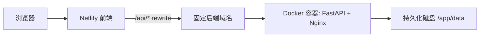

# IvyeaOps 长期稳定部署手册

## 结论

当前的 Netlify 页面如果继续代理到 Cloudflare quick tunnel，就一定不稳定。quick tunnel 是临时通道，电脑关机、后端进程退出、cloudflared 断开、隧道 URL 变化，都会导致登录失败、密码错误、API 无响应或页面一直转圈。

长期稳定方案是：

1. 前端继续部署在 Netlify。
2. 后端部署到一个长期运行的 Docker 服务，例如 Render、Railway、Fly.io 或 VPS。
3. 后端数据目录必须挂载持久化磁盘。
4. Netlify 的 `/api/*` 只代理到固定后端域名，不再代理到临时 tunnel。

推荐第一版使用 Render + Docker + Persistent Disk；如果后续需要更强可控性，再迁移到 VPS。

## 架构



## 必要环境变量

后端生产环境必须设置：

| 变量 | 必填 | 说明 |
| --- | --- | --- |
| `ADMIN_PASSWORD` | 首次部署建议填 | 初始管理员密码，容器会自动生成 `IVYEA_OPS_PASSWORD_HASH` |
| `IVYEA_OPS_PASSWORD_HASH` | 二选一 | 如果不用明文密码，就填 bcrypt hash |
| `IVYEA_OPS_SECRET` | 必填 | 会话签名密钥，必须长期固定，重置会导致登录态失效 |
| `IVYEA_OPS_USER` | 建议填 | 默认 `admin` |
| `IVYEA_OPS_DEV` | 必填 | 生产环境填 `0` |
| `IVYEA_OPS_ALLOWED_ORIGINS` | 必填 | Netlify 域名，例如 `https://xxx.netlify.app` |
| `IVYEA_OPS_COOKIE_DOMAIN` | 通常留空 | Netlify 代理同源访问时留空 |

Sorftime、SIF、AI provider 等 key 不建议写进仓库。部署后在系统配置页面填写，它们会存进持久化数据目录。

## 方案 A：Render 部署后端

项目根目录已经提供 `render.yaml`。它会使用项目已有的 `Dockerfile`，并把 `/app/data` 挂成持久化磁盘。

步骤：

1. 把项目推送到 GitHub 仓库。
2. 打开 Render，选择 New Blueprint 或 New Web Service。
3. 连接这个仓库。
4. 确认使用 Dockerfile 构建。
5. 设置环境变量：
   - `ADMIN_PASSWORD`
   - `IVYEA_OPS_SECRET`
   - `IVYEA_OPS_DEV=0`
   - `IVYEA_OPS_USER=admin`
   - `IVYEA_OPS_ALLOWED_ORIGINS=https://你的-netlify-域名`
6. 确认 Persistent Disk 挂载路径是 `/app/data`。
7. 部署完成后访问：
   - `https://你的后端域名/api/health`

如果返回健康状态，后端就稳定在线了。

## 方案 B：VPS Docker Compose 部署后端

适合你想长期自控、绑定自己的域名、以后扩容更多服务。

服务器准备：

```bash
sudo apt update
sudo apt install -y docker.io docker-compose-plugin nginx certbot python3-certbot-nginx
```

部署：

```bash
git clone <你的仓库地址> /opt/ivyea-ops
cd /opt/ivyea-ops
mkdir -p data
```

创建 `.env`：

```bash
ADMIN_PASSWORD=你的管理员密码
IVYEA_OPS_SECRET=生成一次后长期保存的随机字符串
IVYEA_OPS_DEV=0
IVYEA_OPS_USER=admin
IVYEA_OPS_ALLOWED_ORIGINS=https://你的-netlify-域名
IVYEA_OPS_COOKIE_DOMAIN=
PORT=8080
```

启动：

```bash
docker compose up -d --build
curl http://127.0.0.1:8080/api/health
```

再用 Nginx 和 HTTPS 把公网域名反代到 `127.0.0.1:8080`。

## Netlify 前端配置

后端稳定域名准备好后，把根目录 `netlify.toml` 的 `/api/*` 代理地址改为固定后端域名。

模板已放在：

```text
deploy/netlify/netlify.stable.example.toml
```

关键配置：

```toml
[[redirects]]
  from = "/api/*"
  to = "https://YOUR_BACKEND_DOMAIN/api/:splat"
  status = 200
  force = true
```

注意：

- `YOUR_BACKEND_DOMAIN` 不要带最后的 `/api`。
- Netlify 的 SPA catch-all 必须放在 `/api/*` 后面。
- 不要把 API key 或密码写进 `netlify.toml`。

## 验收清单

后端：

```bash
curl https://你的后端域名/api/health
```

前端代理：

```bash
curl https://你的-netlify-域名/api/health
```

登录：

1. 打开 Netlify 站点。
2. 用 `IVYEA_OPS_USER` 和 `ADMIN_PASSWORD` 登录。
3. 进入系统配置，重新检测 Sorftime/SIF/AI provider。
4. 跑一次市场调研，确认不会再出现临时 tunnel 断开导致的空白或密码错误。

## 常见故障

### 登录显示密码错误，但本地能登录

通常不是密码真的错，而是 Netlify 代理的后端不是同一个后端，或后端重启后使用了不同的 `IVYEA_OPS_SECRET` / `ADMIN_PASSWORD`。

处理：

1. 检查 Netlify `/api/health` 是否代理到正确后端。
2. 确认生产后端环境变量没有变。
3. 确认 `/app/data` 是持久化磁盘。

### 页面无反应或一直转圈

通常是 `/api/*` 代理失败。

处理：

1. 访问 `https://你的-netlify-域名/api/health`。
2. 如果失败，直接访问 `https://你的后端域名/api/health`。
3. 后端正常但 Netlify 不正常，检查 `netlify.toml` 代理地址。
4. 后端也不正常，检查云平台日志或 Docker 日志。

### Sorftime/SIF key 配好了但不可用

先确认后端稳定在线，再去系统配置页点测试。数据源 key 是运行时配置，必须保存在持久化数据目录里；如果没有挂持久化磁盘，重启后可能丢失。

## 当前临时部署为什么不稳定

临时方案链路是：

```text
Netlify -> Cloudflare quick tunnel -> 你的电脑 127.0.0.1:8001
```

这条链路只适合临时测试，不适合长期使用。长期部署必须改成：

```text
Netlify -> 固定公网后端域名 -> 云端 Docker 服务
```
